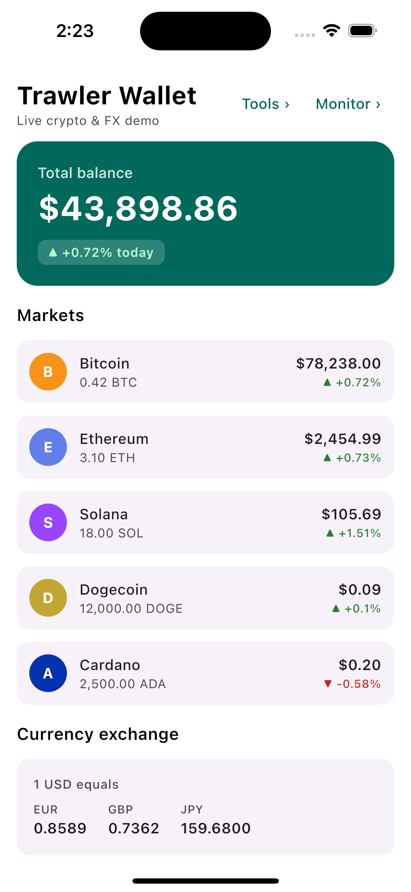
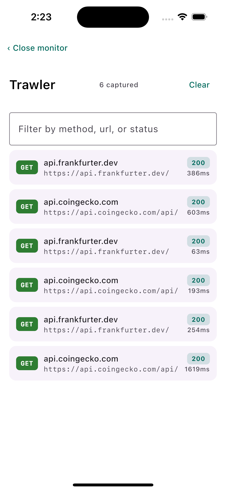
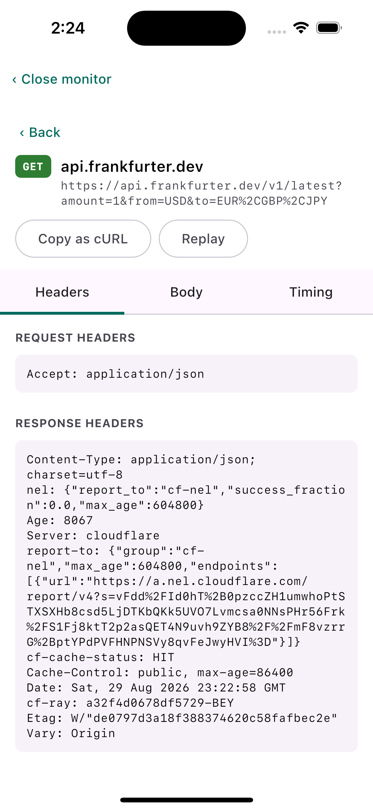
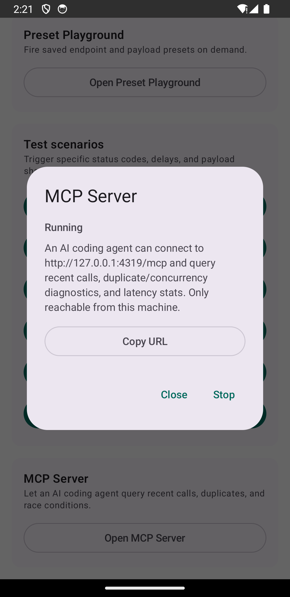

# Trawler

[](https://github.com/alirahal01/trawler/actions/workflows/ci.yml)

A lean, extensible network request monitor for Ktor clients on Kotlin
Multiplatform (Android, iOS, Desktop/JVM). Capture HTTP traffic in-app,
inspect it in a Compose Multiplatform viewer, and extend it through a small
`MonitorExtension` API — replay/edit-resend, preset-driven API firing, and
letting an AI coding agent query it live over MCP all ship as first-party
extensions built against that same contract, so you can add your own without
forking the library.

Trawler is a clean-room alternative to
[KtorMonitor](https://github.com/CosminMihuMDC/KtorMonitor) and
[Wormholy](https://github.com/pmusolino/wormholy) (iOS-only): same problem
space, no shared code, and a deliberately smaller dependency footprint (no DI
container, no persistence layer in core — see
[docs/LEAN_FOOTPRINT.md](docs/LEAN_FOOTPRINT.md)).

See [CONTEXT.md](CONTEXT.md) for the project's glossary and
[docs/adr/](docs/adr/) for the foundational architectural decisions.

<p align="center">
  
  
  
  
</p>

<p align="center">
  <sub>
    Left to right: the sample app (a live crypto/FX wallet built to exercise
    real traffic), the monitor list, a call's headers with Copy as
    cURL/Replay, and an AI agent's MCP connection running on-device.
  </sub>
</p>

## Installation

Available on JitPack (`v0.1.2`):

```kotlin
repositories {
    maven { url = uri("https://jitpack.io") }
}

kotlin {
    sourceSets {
        commonMain.dependencies {
            implementation("com.github.alirahal01.trawler:monitor-core:v0.1.2")
            implementation("com.github.alirahal01.trawler:monitor-ktor:v0.1.2")
            implementation("com.github.alirahal01.trawler:monitor-extensions-api:v0.1.2")
            implementation("com.github.alirahal01.trawler:monitor-ui-compose:v0.1.2")

            // optional first-party extensions
            implementation("com.github.alirahal01.trawler:curl-export:v0.1.2")
            implementation("com.github.alirahal01.trawler:replay:v0.1.2")
            implementation("com.github.alirahal01.trawler:preset-playground:v0.1.2")
        }
        // mcp-server is Android + Desktop only (see below) — add it to
        // those source sets specifically, not commonMain.
        androidMain.dependencies {
            implementation("com.github.alirahal01.trawler:mcp-server:v0.1.2")
        }
        desktopMain.dependencies {
            implementation("com.github.alirahal01.trawler:mcp-server:v0.1.2")
        }
    }
}
```

Each module resolves to the right Android/iOS/Desktop variant automatically
through Gradle's normal KMP dependency resolution — verified directly against
the built JitPack artifacts, not just documented from assumption.

## Modules

- `monitor-core` — `CapturedCall` model and the `CallStore` ring buffer. No
  Ktor or Compose dependency.
- `monitor-ktor` — the Ktor `ClientPlugin` that captures requests/responses.
- `monitor-ui-compose` — the Compose Multiplatform viewer UI.
- `monitor-extensions-api` — the `MonitorExtension` contract.
- `extensions/curl-export`, `extensions/replay`, `extensions/preset-playground`
  — first-party extensions built against that contract.
- `extensions/mcp-server` — exposes captured calls to an AI coding agent over
  MCP; see [AI agent integration](#ai-agent-integration) below. Android +
  Desktop only (see [ADR-0004](docs/adr/0004-mcp-diagnostics-server-localhost-only-opt-in.md)).
- `sample-app` — Android + iOS + Desktop sample app: **Trawler Wallet**, a
  live crypto/FX dashboard (real CoinGecko + Frankfurter traffic) with a
  Developer Tools screen for edge-case testing, so the monitor has realistic
  traffic to show off instead of a flat list of test buttons.

## AI agent integration

`extensions/mcp-server` runs a localhost-only MCP (Model Context Protocol)
server inside the host app, so an AI coding agent — Claude Code, Claude
Desktop, or anything else that speaks MCP — can query a *live* session's
captured traffic directly instead of a human relaying it by hand: recent
calls, duplicate/retry-storm detection, overlapping-call (race condition)
detection, slow calls, and aggregate stats.

<p align="center">
  
</p>

It never starts on its own. In the sample app, it's one more Developer Tools
card — press Start, and it's live:

```kotlin
val mcpServer = McpServerExtension(monitor = { monitor }, port = 4319)
// ... later, e.g. from a Developer Tools button:
scope.launch { mcpServer.start() }
```

Then point an MCP client at it — for Claude Code:

```bash
claude mcp add --transport http trawler http://127.0.0.1:4319/mcp
```

That's a real, working round trip — output from an actual run against the
sample app on an Android emulator, reached over `adb forward tcp:4319
tcp:4319` (the emulator in this run had no outbound DNS, hence the errors —
`get_call_stats` reports them exactly the same way it would report any other
failure):

```bash
$ curl -s http://127.0.0.1:4319/mcp \
    -d '{"jsonrpc":"2.0","id":1,"method":"tools/call","params":{"name":"get_call_stats","arguments":{}}}'
{"jsonrpc":"2.0","id":1,"result":{"content":[{"type":"text","text":
  "{\"totalCalls\":4,\"errorCount\":4,\"errorRate\":1.0,\"avgDurationMillis\":20828.25,
    \"p50DurationMillis\":20124,\"p95DurationMillis\":20141,
    \"byHost\":{\"api.coingecko.com\":2,\"api.frankfurter.dev\":2},\"byStatus\":{\"error\":4}}"
}],"isError":false}}
```

The server only ever binds to `127.0.0.1` and only exposes what's already
in the (redacted) `CallStore` — see the ADR linked above for why, and
`extensions/mcp-server`'s source for the exact tool list (`list_calls`,
`get_call`, `find_duplicate_calls`, `find_concurrent_calls`,
`find_slow_calls`, `get_call_stats`, `clear_calls`, and an optional
`replay_call`).

## Running the sample app

- **Desktop**: `./gradlew :sample-app:desktopApp:run`
- **Android**: `./gradlew :sample-app:androidApp:installDebug`, or open the repo
  root in Android Studio and run the `androidApp` configuration.
- **iOS**: `sample-app/iosApp/` is an [XcodeGen](https://github.com/yonaskolb/XcodeGen)
  project — `project.yml` is the source of truth, not the generated
  `.xcodeproj`. First time, or after editing `project.yml`:
  ```
  brew install xcodegen
  cd sample-app/iosApp && xcodegen generate
  ```
  Then open `TrawlerSample.xcodeproj` in Xcode and run. The Kotlin framework
  builds automatically via a Run Script build phase
  (`embedAndSignAppleFrameworkForXcode`) — no separate Gradle step needed.

## Status

Core capture pipeline, redaction, the Compose viewer, and all four
first-party extensions (`curl-export`, `replay`, `preset-playground`,
`mcp-server`) are built and tested. Published to JitPack as `v0.1.2`; not
yet on Maven Central.

## License

Apache-2.0 — see [LICENSE](LICENSE).
